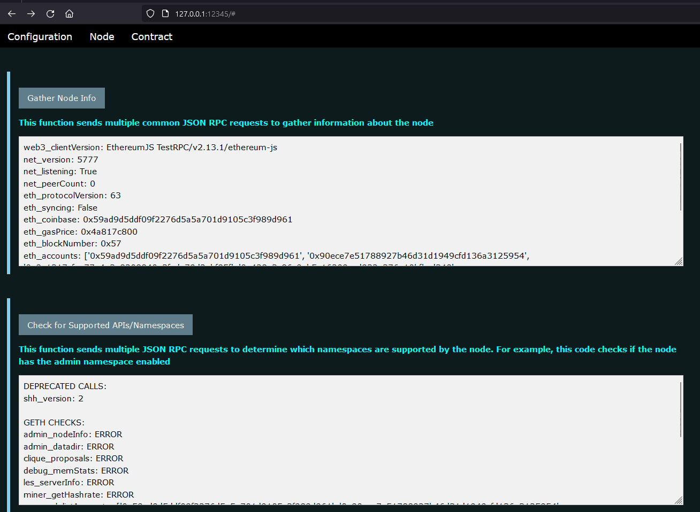
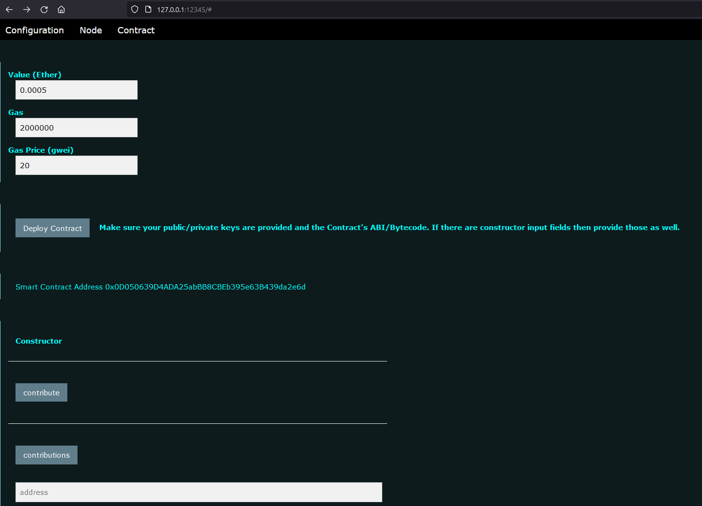
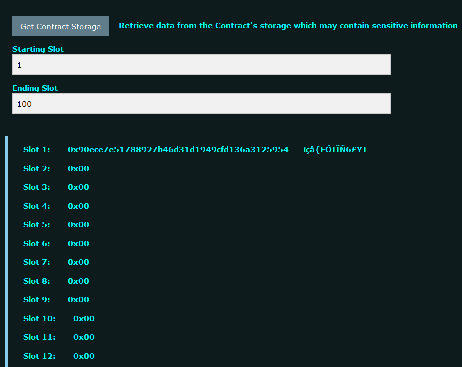

# ethPenTesting

### Overview

**ethPenTesting** is a front end for the [web3](https://web3py.readthedocs.io/en/v5/quickstart.html) python library. It is intended to make interacting/deploying/testing Ethereum Smart contracts easier for those new to the field.

The code consists of a python script which launches a local webserver (http://127.0.0.1:12345/) and interacts with the configured Ethereum blockchain.

This code should **only be used on local/test Ethereum networks**. There will be bugs in the code and interacting with smart contracts will cost you Eth.

##### Installation

* Install python 3.*. Note: As of writing this, the python web3 library is not compatible with python 3.11. I did my testing using python 3.8.

```
python3 -m pip install web3, requests

python3 ethPenTesting.py
```

* In your browser go to http://127.0.0.1:12345/

### Guide/Additional Notes

##### Configuration Tab

* The "Check Connection" button sends 1 request to get the server version
* For the "Your Private Key" field, no need to preface with "0x" just put the hex string. Additionally, only use this tool on local/test networks so if your private key shown here is compromised it doesn't really matter.
* For the Smart Contract Bytecode section just enter the hex bytes. If you copy from a tool like remix it will have a bunch of extra json. Just copy the opcodes.


##### Node Tab

* Intended to give information on the target node.



##### Contract Tab

* The top 3 fields value, gas, gas price apply to all actions take on this page. If the action you're taking requires ethereum to be sent to the contract, then increase the "value" field above 0, and vice versa.
* If the constructor field is shown with arguments then make sure to fill those in before deploying the contract.
* The "Deploy Contract" button requires most of the fields on the configuration tab to be filled in, except the contract address.
* The buttons/input fields below the constructor section are for the smart contract functions. Some of these will require ethereum to be sent as mentioned above. If the inputs are more complicated like "structs" then this code will not work. Feel free to go into the convertArgTypes method if you want to add additional support.
* The "Get Contract Storage" button is very useful when you're curious if the contract is storing sensitive data somewhere it shouldn't.





### Software Bill of Materials

##### Python 3rd party libs

* web3
* http.server
* threading
* requests
* urllib
* json

##### Web server 3rd party libs

* jquery-3.6.1.js
* w3.css

### Code Layout

```
class WebServer(threading.Thread):
  '''
  This class runs the webserver
  Outputs: http://127.0.0.1:12345
  '''

class handler(BaseHTTPRequestHandler):
  '''
  This class handles the webserver requests/responses
  '''

class ethPenTesting():
    '''
    Inputs: Node information (ip, port, etc...)
    Processing: Interact with the ethereum node to perform various tasks
    Outputs:
    '''

    def callRPC(self, method, params, custom_json=0):
      '''
      This is the generic method that makes RPC calls

      Inputs: jsonrpc method, params, or optionally custom_json which allows you to send malformed stuff to the node
      Processing: Send the request to the node
      Outputs: Return the response, or return "error"
      '''

    def checkConnection(self):
      # Make a simple rpc call to see if the configuration info is correct

    def gatherNodeInfo(self):
      '''
      INPUTS: node information like IP, port, etc...
      PROCESSING: Send multiple common JSON RPC requests to the node to gather info
      OUTPUTS: Return a string with all the responses for the web app
      '''

    def checkAPI(self):
      '''
      INPUTS: node information like IP, port, etc...
      PROCESSING: Send multiple requests to interesting endpoints. See if they have the
                 admin endpoints enabled by mistake for example.
      OUTPUTS: Return a string with all the responses for the web app
      '''

    def sendMalformed(self):
      '''
      INPUTS: node information like IP, port, etc...
      PROCESSING: Send a few malformed requests in order to hopefully induce a stack trace
                  which should reveal what kind of node they're running
      OUTPUTS: Return a string with all the responses for the web app
      '''
    def parseABI(self, abi):
      '''
      INPUTS: abi
      PROCESSING: parse the abi
      OUTPUTS: dynamic html with the abi fields
      '''

    def convertArgTypes(self, contract_args, abi, function_name):
      '''
      INPUTS: dictionary with arguments for a contract function
      PROCESSING: using the contract abi, convert the arguments into their appropriate data type
      OUTPUTS: return dictionary with arguments for contract function but with the correct data type
      '''

    def deployContract(self, node_info):
      '''
      INPUTS: node information like IP, port, etc... and your public address/private key and the contract's abi/bytecode
      PROCESSING: send a transaction to deploy the contract
      OUTPUTS: Return the deployed address
      '''

    def callFunction(self, node_info):
      '''
      INPUTS: node information like IP, port, etc... and your public address/private key and the contract's abi/bytecode
      PROCESSING: send a transaction to called contract's function
      OUTPUTS: Return the result
      '''

    def getContractStorage(self, your_public_address, contract_address, storage_slot_start, storage_slot_end):
      '''
      INPUTS: node information like IP, port, etc... and your public address and the contract's address
              Also the beginning storage slot and ending storage slot
      PROCESSING: Send multiple requests to get the contract's storage
      OUTPUTS: Return a string with all the responses for the web app
      '''
```
